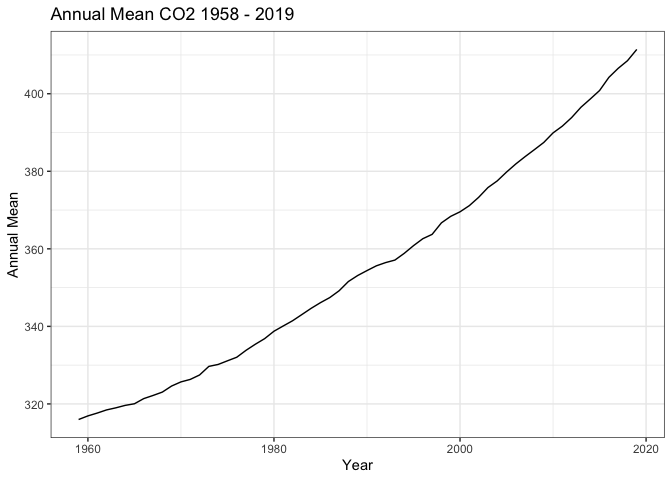

One Script, Many Products
================
Erik Woyciesjes
10/29/2020

# Mauna Loa CO2 Annual Mean Data

    ## Parsed with column specification:
    ## cols(
    ##   `#` = col_logical(),
    ##   year = col_double(),
    ##   mean = col_double(),
    ##   unc = col_double()
    ## )

\# Data Plotted

<!-- -->

\# Arrage Data for Table

    ## Selecting by unc

\# Data Table

| \# | year |  mean  | unc  |
| :-: | :--: | :----: | :--: |
| NA | 2019 | 411.43 | 0.12 |
| NA | 2018 | 408.52 | 0.12 |
| NA | 2017 | 406.55 | 0.12 |
| NA | 2016 | 404.22 | 0.12 |
| NA | 2015 | 400.83 | 0.12 |
| NA | 2014 | 398.64 | 0.12 |

Annual Means for the Last Decade
